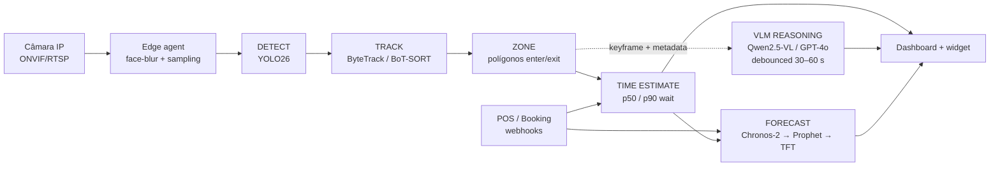

# Restaurant Wait-Time Estimator — Mapa de Requisitos

Diagrama de apoio à leitura da [blueprint técnica](./blueprint.md). Organiza os requisitos em quatro vistas: os 5 requisitos não-funcionais, o pipeline funcional, a hierarquia das 10 áreas técnicas e as dependências críticas entre elas.

## 1. Os 5 requisitos não-funcionais (devem coexistir)

```
                      ┌──────────────────────────────┐
                      │   5 REQUISITOS NÃO-FUNCIONAIS│
                      │      (devem coexistir)       │
                      └──────────────┬───────────────┘
        ┌────────────┬───────────────┼───────────────┬────────────┐
        ▼            ▼               ▼               ▼            ▼
   ① ESCALA      ② PRIVACY      ③ INTEGRAÇÕES   ④ CV+VLM      ⑤ FORECAST
   elástica      by-design      POS / booking    pipeline      séries temp.
   1 → milhares  GDPR/CCPA      Toast, Square    YOLO26+track  Prophet/TFT/
   de sítios     EDPB 3/2019    OpenTable, Resy  + Qwen-VL     Chronos-2
```

## 2. Pipeline funcional (4 estágios + 2 camadas)

```
  câmara IP                                                       dashboard
      │                                                                ▲
      ▼                                                                │
  ┌────────┐   ┌────────┐   ┌────────┐   ┌────────────┐   ┌──────────────┐
  │DETECT  │──▶│ TRACK  │──▶│ ZONE   │──▶│ TIME       │──▶│ FORECAST     │
  │YOLO26  │   │ByteTrk │   │polígono│   │ ESTIMATE   │   │ Prophet/TFT  │
  │NMS-free│   │BoT-SORT│   │+ enter │   │p50/p90 wait│   │ Chronos-2    │
  └────────┘   └────────┘   │/exit ev│   └────────────┘   └──────────────┘
                            └────┬───┘            ▲
                                 │                │ POS/booking signals
                                 ▼                │
                            ┌────────────────────────┐
                            │ VLM REASONING (cadência │   "porquê está
                            │ debounced 30–60 s ou    │    o queue lento?"
                            │ on-anomaly)             │
                            │ Qwen2.5-VL / GPT-4o     │
                            └────────────────────────┘
```

Versão Mermaid do mesmo fluxo:



## 3. As 10 áreas técnicas (mapa hierárquico)

```
ROOT: RESTAURANT WAIT-TIME ESTIMATOR
│
├─ §1 CLOUD & DEPLOYMENT
│    ├─ ref. arch (hub-and-spoke, edge agent)
│    ├─ AWS vs GCP vs Azure  → recomendação: AWS (KVS + Timestream-InfluxDB)
│    ├─ ingestão vídeo: RTSP / WebRTC / SRT / edge-agent
│    ├─ HÍBRIDO edge+cloud  ★ decisão crítica p/ EU
│    ├─ K8s + Triton + serverless GPU (Modal / RunPod / Baseten)
│    ├─ auto-scaling: fps adaptativo / HPA / pré-aquecer pico
│    └─ COGS ≈ $50–60/restaurante/mês
│
├─ §2 DETECÇÃO & TRACKING
│    ├─ YOLO26 (NMS-free, ProgLoss, STAL, MuSGD)
│    ├─ tracker: ByteTrack default · BoT-SORT premium
│    ├─ Re-ID NÃO-biométrico (roupa/silhueta, RAM-only)
│    ├─ oclusão: top-down + multi-câmara + density-map
│    └─ stack: ultralytics · supervision · boxmot · torchreid
│
├─ §3 VLM
│    ├─ tier-1 (CV per-frame) + tier-2 (VLM debounced)
│    ├─ triggers: queue +50 % · dwell p95 · service vazio · POS flat
│    ├─ EU: Qwen2.5-VL self-hosted (vLLM)  · US: GPT-4o/Gemini
│    └─ saída JSON-schema constrained
│
├─ §4 FORECAST "BEST TIME TO VISIT"
│    ├─ cold-start: Chronos-2 zero-shot
│    ├─ warm: Prophet / NeuralProphet
│    ├─ mature: TFT global + embedding por loja
│    ├─ features: calendário · weather · eventos · POS · promos
│    ├─ intervalos q10–q90 (nunca número único)
│    └─ DB: TimescaleDB (default) · ClickHouse (OLAP)
│
├─ §5 PRIVACY GDPR / CCPA  ★★★ secção decisiva
│    ├─ base legal: Art. 6(1)(f) + LIA  (consent inviável)
│    ├─ NÃO Art. 9 → sem face-recog / age / gender / emotion
│    ├─ blur de faces no edge ANTES da cloud
│    ├─ minimização: só ts, tracker_id, zone_id, dwell
│    ├─ sinalética 3 camadas (pictograma · QR · DPO)
│    ├─ retenção: vídeo 0 · eventos 90d · agregados 24m
│    └─ DPIA + sub-processadores + SCC EU↔US
│
├─ §6 POS & BOOKING
│    ├─ POS: Toast · Square · Lightspeed · Clover · Micros · Revel
│    ├─ Booking: OpenTable · Resy · SevenRooms · TheFork
│    ├─ schema interno PosEvent normalizado
│    ├─ webhooks: idempotência · clock-skew · replay · rate-limit
│    └─ auth: OAuth2 · HMAC · mTLS (enterprise)
│
├─ §7 BACKEND & API
│    ├─ FastAPI (BFF) · Go (connectors) · gRPC interno · WS/SSE live
│    ├─ Postgres (tenants) + TimescaleDB (séries) + Redis (live)
│    ├─ MULTI-TENANCY: RLS + GUC app.current_tenant_id  ★ espinha
│    ├─ pgbouncer + SET LOCAL · role sem BYPASSRLS
│    └─ gateway · rate-limit por tenant · OTel · mTLS interno
│
├─ §8 FRONTEND
│    ├─ operador: React 19 + TanStack Query + ECharts
│    ├─ widget cliente: Web Component embebível ~30 KB
│    ├─ "Best Time" gráfico q50 + banda q10–q90 + live + histórico
│    └─ live overlay: HLS ou KVS-WebRTC + bbox client-side
│
├─ §9 MLOps & MONITORING
│    ├─ MLflow / W&B + shadow-mode + A/B por loja
│    ├─ drift: detecção · features · forecast (PSI · MAPE)
│    ├─ Prometheus · Grafana · Loki · Tempo
│    └─ retraining noturno (Kubeflow / SageMaker / Vertex)
│
└─ §10 ROADMAP
     ├─ MVP 90 d  (1 POS · 1 booking · Prophet · ~6.5 FTE)
     ├─ V1  4–9 m (YOLO26 fine-tune · TFT · VLM · SOC2)
     └─ V2  yr 2  (density · multi-língua · self-serve · WhatsApp)
```

## 4. Dependências críticas entre requisitos

```
  ② PRIVACY ──── obriga ───▶ §1.4 edge híbrido (blur on-site)
                obriga ───▶ §2.3 Re-ID não-biométrico
                obriga ───▶ §3   VLM self-host p/ EU
                obriga ───▶ §5.3 minimização storage

  ① ESCALA  ──── obriga ───▶ §1.5 K8s + Triton + serverless burst
                obriga ───▶ §7.4 RLS multi-tenant
                obriga ───▶ §1.6 pré-aquecer pico almoço/jantar

  ④ CV+VLM  ──── obriga ───▶ §3.2 two-tier (custo)
                obriga ───▶ §9   shadow-mode antes de promover

  ⑤ FORECAST ─── obriga ───▶ §4.2 features (weather/eventos/POS)
                obriga ───▶ §6   integração POS p/ feed real-time
                obriga ───▶ §4.4 TimescaleDB

  ③ INTEGRA. ─── obriga ───▶ §6.3 idempotência + replay
                obriga ───▶ §5.6 SCC se sub-processador US
```



```mermaid
flowchart TD
    P[② PRIVACY] --> S14[§1.4 edge híbrido]
    P --> S23[§2.3 Re-ID não-biométrico]
    P --> S3[§3 VLM self-host EU]
    P --> S53[§5.3 minimização]
    E[① ESCALA] --> S15[§1.5 K8s + Triton]
    E --> S74[§7.4 RLS multi-tenant]
    E --> S16[§1.6 pré-aquecer pico]
    C[④ CV+VLM] --> S32[§3.2 two-tier]
    C --> S9[§9 shadow-mode]
    F[⑤ FORECAST] --> S42[§4.2 features]
    F --> S6[§6 POS feed]
    F --> S44[§4.4 TimescaleDB]
    I[③ INTEGRAÇÕES] --> S63[§6.3 idempotência]
    I --> S56[§5.6 SCC]
```

## Decisões mais consequentes (★)

1. **§1.4 — Edge-cloud híbrido**: converte a cloud de "processador de vídeo" em "processador de metadados"; reduz a superfície da DPIA e a largura de banda 10–100×.
2. **§5 — Postura de privacidade**: base legal Art. 6(1)(f), nunca Art. 9; blur no edge; sem demografia.
3. **§7.4 — Multi-tenancy com RLS**: `tenant_id` em todas as tabelas + GUC de sessão; role runtime sem `BYPASSRLS`.

Acertar nestas três é o que separa um pilote europeu viável de um produto que não passa da avaliação do DPO do cliente.
